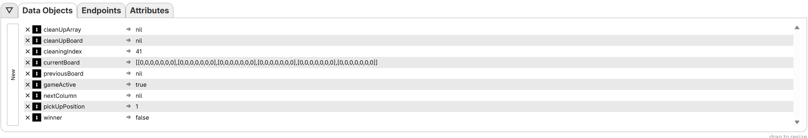
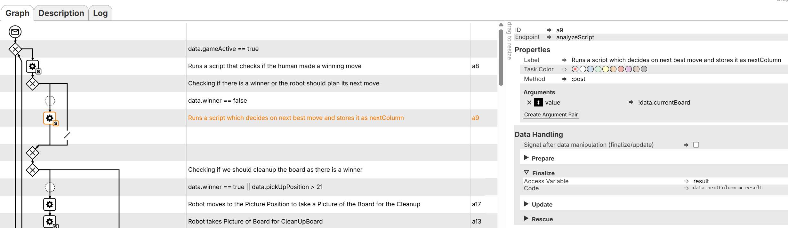
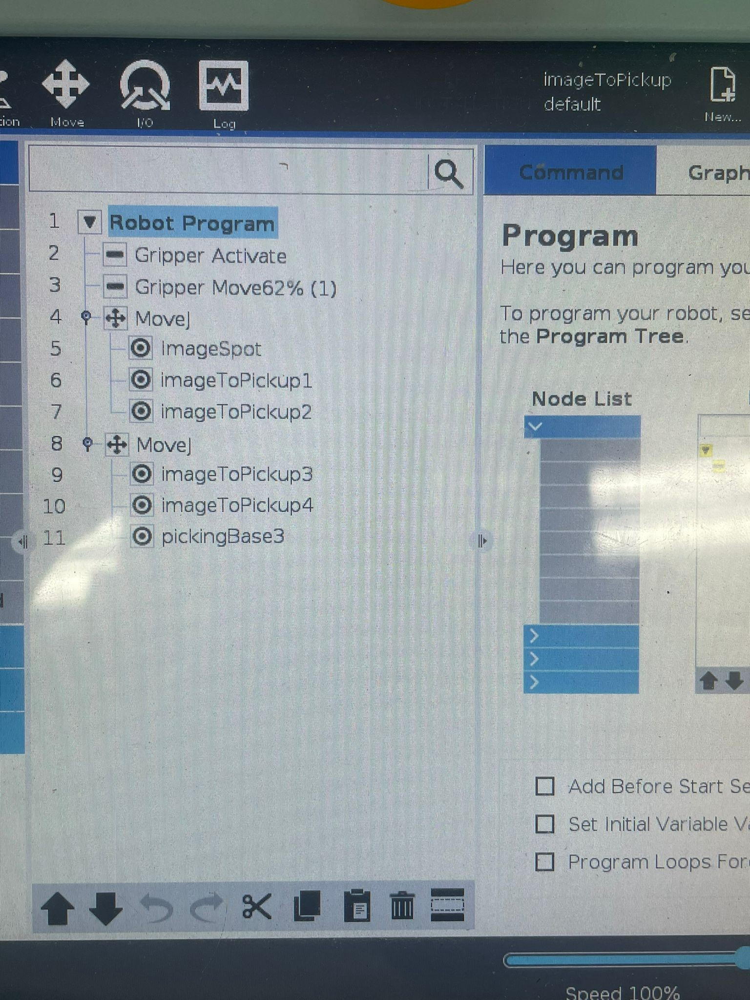
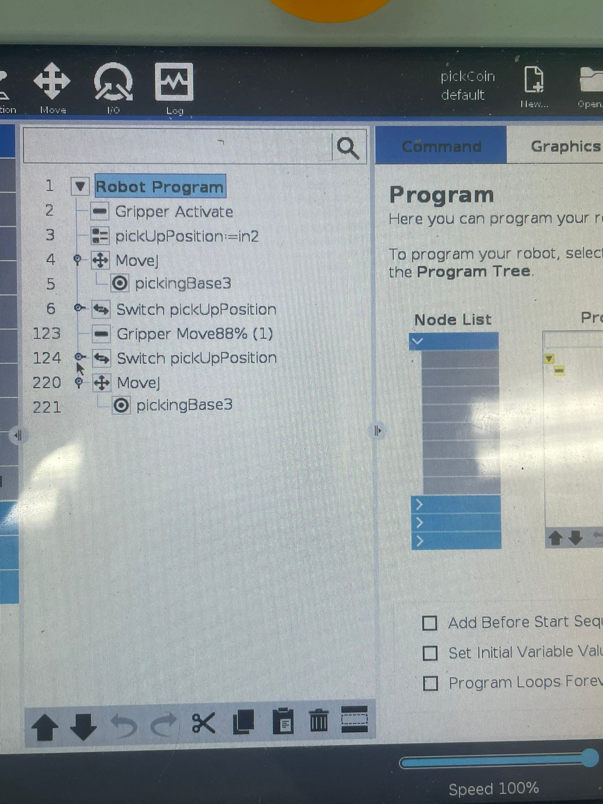
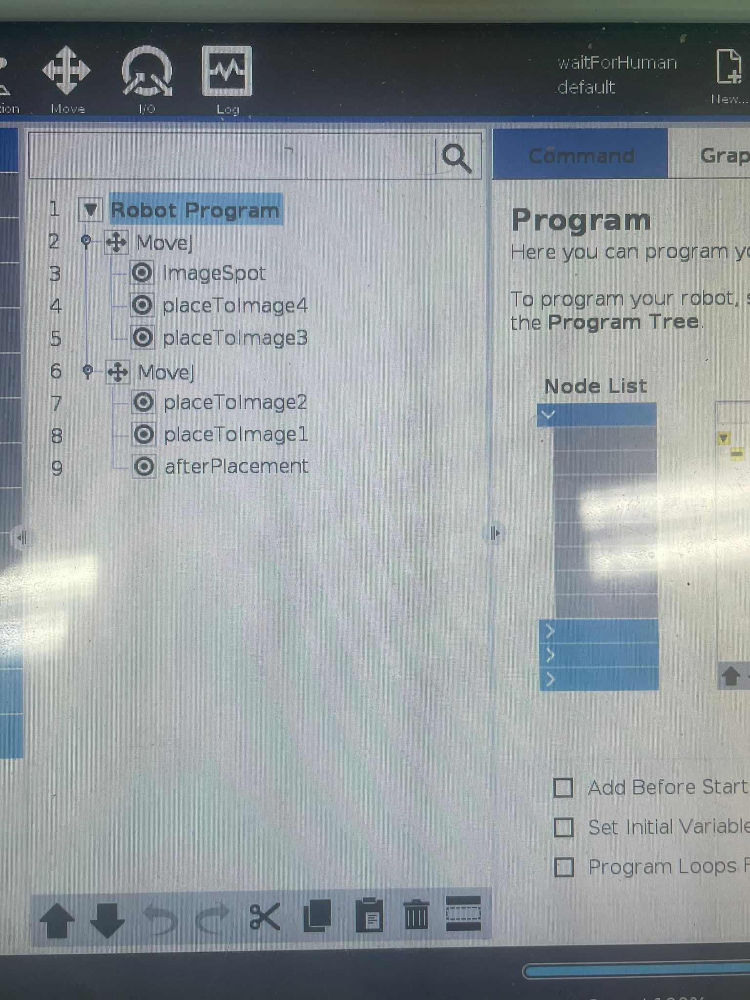
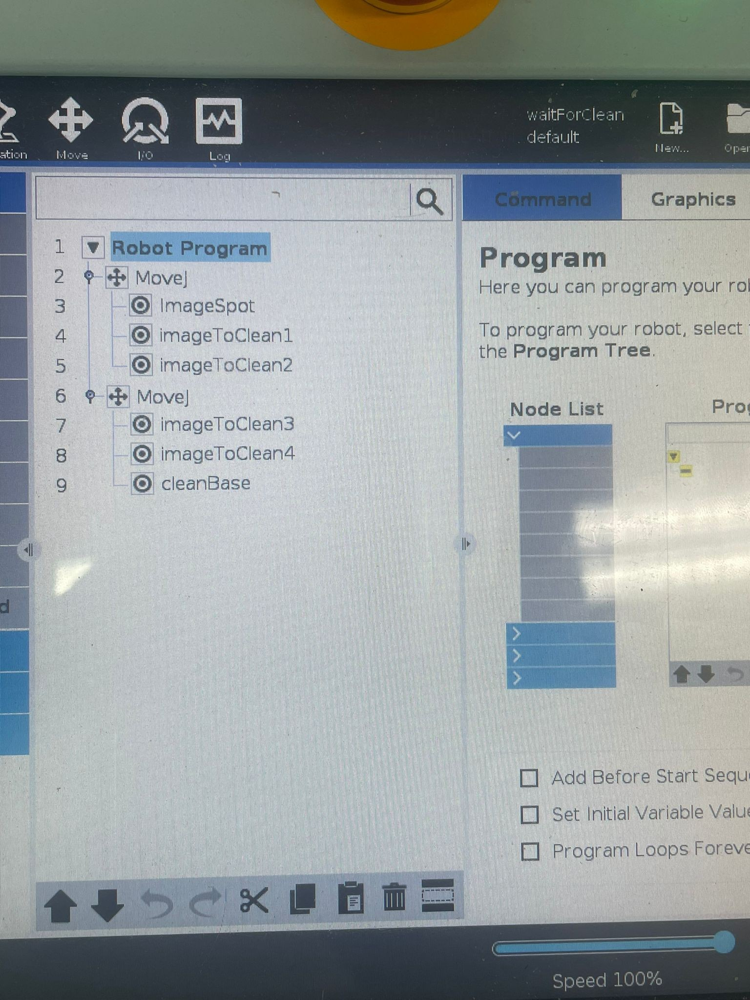
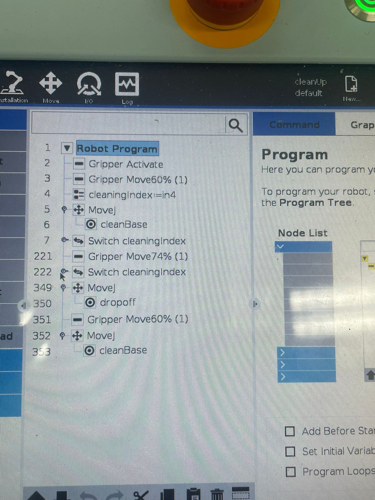

# Automated Connect4 Game - Documentation

Welcome to the Documentation of the **automated Connect4 Game** using the fabulous **CPEE**

---

## DATA OBJECTS
| Variable | Description |
|-----------|--------------|
|**`cleanUpArray`** |  Boolean array of the board state for cleanup Movement. `True` → coin present at `cleaningIndex`, `False` → empty. |
| **`cleanUpBoard`** | Board state right before the cleanup movement. Converted into `cleanUpArray` before cleanUp Movement. |
| **`cleaningIndex`** | Index used for the cleanup movement. Used to ensure every field is checked. |
| **`currentBoard`** | Current state of the game board, used for move analysis and comparison with `previousBoard`. |
| **`previousBoard`** | Board state updated after robot move to compare with `currentBoard` to detect human moves. |
| **`gameActive`** | Boolean controlling the main loop. Set to `false` when the cleanup finishes and a winner is found. |
| **`nextColumn`** | Determined by `analyze_script`; tells the robot as input before the dropCoin Movement which column to drop the next coin into. |
| **`pickUpPosition`** | Current coin pickup position passed to the robot as input for the pickCoin Movement. Incremented after each pickup. |
| **`winner`** | Boolean for the inner game loop; set to `true` when `check_winner.py` detects a win. |

*Initial Data Objects at execution start:*  

---

## ENDPOINTS

### Movements
| Movement | Program | Description |
|-----------|---------|-------------|
| **imageToPickupMovement** | `imageToPickup.urp` | Robot moves from the picture Position to the base Position over the rack for the next pickUp (picture Position --> Base Position over Rack) |
| **pickCoinMovement** | `pickCoin.urp` | Robot receives current `pickUpPosition` as Input and picks up coin at that position (Base Position over Rack --> pickUp) |
| **liftCoinMovement** | `liftCoin.urp` | Robot again receives the current `pickUpPosition` as Input and lifts Coin at that Position and gets back to the rack (pickUp --> Base Position over Rack)
| **rackToBoardMovement** | `rackToBoard.urp` | Robot moves with Coin to the base position over the Board (Base Position over Rack --> Base Position over Board) |
| **dropCoinMovement** | `dropCoin.urp` | Robot receives `nextColumn` as Input and drops Coin in that column (Base Position over Board --> dropCoin --> Base Position over Board) |
| **picturePositionMovement** | `picture.urp` | Robot moves from Base Position over Board to the picture Position to take picture of Board (Base Position over Board --> Picture Position) |
| **waitingPositionMovement** | `waitForHuman.urp` | Robot moves from picture Position to base position over board to wait for human to move (Picture Position --> Base Position over Board) |
| **waitCleaningMovement** | `waitForClean.urp` | Robot moves from picture Position to cleanbase position to start the cleaning Movement (picturePosition --> Cleanbase Position) |
| **cleanUpMovement** | `cleanUp.urp` | Robot receives current `cleaningIndex` and cleans up position if `cleanUpArray` is true at index (Cleanbase Position --> CleanUp --> Cleanbase Position) |

### Input Values
| Variable | Input | Description |
|-----------|------------|-------------|
| **`nextColumn`** | sent on 0 → received at 1 | Determines the next Column where robot should drop off the picked up Coin |
| **`pickUpPosition`** | sent at 1 → received at 2 | Determines the current pickUp Position for the next Coin. Is incremented by 1 after each pickup |
| **`cleaningIndex`** | sent at 3 → received at 4 | Determines the current cleaningIndex for the cleanup Movement. CleaningIndex of cleanUpArray is checked if there is a coin for cleanup |

### Requests & Scripts
| Script | Port/Endpoint | Function |
|---------|------|----------|
| **`captureScript`** | `8734/capture_board` | Request forwarded to the Banana PI. Runs the `capture_board.py` and sets the current state of the board |
| **`analyzeScript`** | `8734/analyze` | Runs `analyze_board.py` to determine the next best move and thereby sets the `nextColumn` value |
| **`cleanupScript`** | `8735/cleanup` | Runs `cleanup_board.py` to turn `cleanUpBoard` State into the boolean `cleanUpArray` for the cleanUp Movement |
| **`checkWinnerScript`** | `8736/check_winner` | Runs `check_winner.py`  and determines if there is a winner to set the `winner` data Object to true if that is the case |

*Endpoints necessary for the execution:*  

--- 

## Main Game Flow
1. **Check game status:**
    If `gameActive == true`, enter main loop.

2. **Human move check:**  
    Run `check_winner.py` with `currentBoard` as Argument to check if the human made a winning move in its latest move.
    Access result variable to set the `winner` data object to true or false

3. **If no winner:**  
    Run the `analyze_board.py` with `currentBoard` as Arugment to determine next best move. 
    Access result variable to set the `nextColumn` data object

    

4. **If still active:** 
    Check if `winner == true`, to determine if cleanUp Process should be started
    If `winner` data Object is still false, the main game flow proceeds

5. **Move to rack base:**
    Move from the picture Position to the base Position over the Rack to prepare the next pickUp of a Coin (`imageToPickupMovement`)

6. **Send current pickUpPosition:**
    Send the value of the current `pickUpPosition` to the robot as an input for the `pickCoinMovement`
    

7. **Pickup Coin:**
    Pickup the coin at the current `pickUpPosition` (`pickCoinMovement`)
    Lift the coin at the current `pickUpPosition` and end the movement in the base position at the rack (`liftCoinMovement`)

9. **Move to Board:**
    Move with the picked up Coin to the base Position over the board (`rackToBoardMovement`)

10. **Send value of `nextColumn`:**
    Send the value of the `nextColumn` to the robot as input for the `dropCoinMovement`
    

11. **Drop Coin:**
    Drop the coin at the `nextColumn` and end the movement in the base position over the rack (`dropCoinMovement`)

12. **Move to picture Position:**
    Move from the base Position over the rack to the picture Position to take a picture after the recent robot move (`picturePositionMovement`)

13. **Increment `pickUpPosition`:**
    Increment the `pickupPosition` for the next round in the gameflow

14. **Take Comparison Picture:**
    Run the `capture_board.py` and store the current board state in the `currentBoard` AND `previousBoard` data object by accessing the result variable in CPEE
    

15. **Check winning robot move:**
    Check if robot made a winning move by running the `check_winner.py` with `currentBoard` as Input Argument. 
    Access result variable to store the result in the `winner` data Object

16. **No winner, proceed to wait:**
    If robot did not make a winning move, the robot moves from picturePosition to base position over Board to let human make the next move (`waitingPositionMovement`)

17. **Wait for Human:**
    Wait for 5 seconds to give human time to make its next move

18. **Move to picture Position:**
    Move to the picture Position to take comparision picture to see if the human made its move (`picturePositionMovement`)

19. **Take Comparison Picture:**
    Take picture of the board by running `capture_board.py` and store the current board state in the `currentBoard` Data Object

20. **Check if human made its move:**
    Check if the human needs more time (`currentBoard == previousBoard`). If so, move to waiting Position again (`waitingPositionMovement`)
    

    Otherwise if human made its move, the gameflow starts at the beginning again  

---

## Cleanup Flow

1. **Triggered when `winner == true` OR `pickupPosition > 21`:**
    If someone won or there are no more coins left, the winner variable is set to true, which allows access to the cleanup alternative path of the process

2. **Move to picture Position:**
    Robot moves to the picture position to take picture of the board for the cleanup (`picturePositonMovement`)

3. **Take picture for cleanup board state:**
    Run the `capture_board.py` script to take the picture of the board for the cleanup. `
    Access result variable to store it in the data object `cleanUpBoard`
    

4. **Transform `cleanupBoard` to boolean `cleanUpArray`:**
    Run the `cleanup_board.py` to transform the data object `cleanUpBoard` into the `cleanUpArray` which is an array of 41 trues/falses to determine if the position holds a coin
    

5. **Move to cleanbase:**
    Move from the picture position to the clean base position as preparation for the cleanup Movement (`waitCleaningMovement`)

6. **Start cleanup Loop:**
    Check if at the current `cleaningIndex` in the `cleanUpArray` there is a coin (is true), if yes start `cleanupMovement`; 
    Otherwise decrement `cleaningIndex` by one

7. **Send Position of `cleaningIndex`:**
    If there is a coin (is true), send the value of current `cleaningIndex` to the robot as input for the `cleanUpMovement`
    

8. **Perform `CleanUpMovement` of `cleaningIndex` Position:**
    Perform `cleanUpMovement` by picking up coin at `cleaningIndex` Position of the board and dropping it at the dropoff location (`cleanUpMovement`)
    Decrement `cleaningIndex` after successful cleanup by 1 to move on to the next position 
    

9. **Iterate:**
    Steps 6-8 are looped until the whole board is cleaned up. 
    If that is the case, `gameActive` is set to false to exit the main game loop

---

### Movements

**ImageToPickup Movement**

**PickCoin Movement**

**RackToBoard Movement**

**Drop Coin Movement**

**Picture Movement**

**WaitForHuman Movement**

**WaitForClean Movement**

**Cleanup Movement**

### Screenshots of Running Scripts

**analyze_board.py in Action**
    Screenshot of analyzing the board and choosing `nextColumn` over multiple rounds
    

**check_winner.py in Action**
    Screenshot of analyzing board states to decide if there is a winner and setting the `winner` data object
    

**capture_board.py in Action**
    Screenshot of capturing the board state over multiple rounds
    

**cleanup_board.py in Action**
    Screenshot of transforming the `cleanupBoard` into the `cleanUpArray` two times
    

